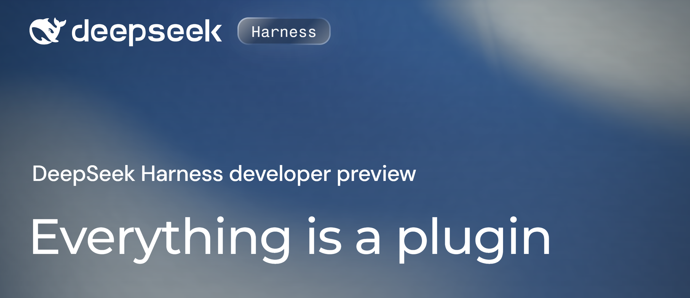

# DeepSeek Harness

> **DeepSeek Harness** is an open modular execution environment (Agent Harness) for autonomous AI agents. It acts as a bridge between language models and real-world execution environments: file systems, CLI terminals, network requests, and developer tools.

  

---

## Why Choose DeepSeek Harness?

Unlike traditional LLM wrappers, DeepSeek Harness is built around the **Cordis** architecture, where every single component functions as a pluggable extension.

* **"Everything is a Plugin" Architecture:** Models, tools, skills, session stores, orchestration loops, and even the UI are independent plugins. You can swap any configuration element without rebuilding source code.
* **Programmatic Orchestration via Code Mode:** Unlike standard agents that make dozens of sequential tool calls, DeepSeek Harness can generate TypeScript scripts via the Code Mode SDK, chaining complex operations into a single efficient execution pass.
* **Full Transparency and Traceability (Trajectory View):** Every action is logged into an append-only event trail. You can inspect system prompts, Chain-of-Thought (CoT) reasoning, tool calls, and replay, fork, or restart any session.
* **Multi-Model and Local Support:** Out-of-the-box support for the latest DeepSeek models (V4 Pro / Flash), any OpenAI-compatible endpoints, and local LLMs via Ollama or vLLM.
* **Security and Granular Permission Tiers:** Strict sandbox boundaries and 4 permission levels prevent unauthorized file modifications or accidental execution of dangerous terminal commands.
* **Turnkey Desktop Client:** Standalone installer packages for Windows (`.exe`) and macOS (`.dmg`) allow you to launch a full-featured AI development environment without manual Node.js setup or dependency management.

---

## 💻 Desktop Client Installation

The desktop version of DeepSeek Harness comes as a standalone distribution containing an isolated web runtime and management interface.

### 🪟 Windows (`.exe`)

1. Go to the **[Releases](../../releases)** section and download `DeepSeek-Harness-x64.7z`.
2. Run the installer file.
3. The setup wizard will automatically configure required dependencies and create a desktop shortcut.
4. Launch the application — the graphical interface will open automatically in your browser or built-in window.

### 🍏 macOS (`.dmg`)

1. Go to the **[Releases](../../releases)** section and download the appropriate file:
* `DeepSeek-Harness.dmg` (for M processors)
2. Open the downloaded `.dmg` image and drag the **DeepSeek Harness** icon to the **Applications** folder.
3. Upon first launch, allow execution in *System Settings → Privacy & Security* if a Gatekeeper warning appears.

### System Requirements

| Component | Minimum Requirements | Recommended |
| --- | --- | --- |
| **OS** | Windows 10 (1809+) / macOS 12.0+ | Windows 11 / macOS 14+ |
| **Processor** | 64-bit x86 or Apple Silicon | Apple Silicon (M-series) / Intel i7+ |
| **RAM** | 4 GB | 8 GB or higher |
| **Storage** | 1 GB free space | 5 GB (for session logs & indexes) |

*(CLI alternative for developers: `npx @deepseek-ai/dsh web`)*

---

## Complete Feature Overview (A to Z)

### 1. Environment Setup & API Connection

* **Onboarding Wizard:** Prompts you to enter an API Key (DeepSeek, OpenAI, or a custom local URL) upon first launch.
* **Workspace Binding:** Select a working directory on your disk where the agent will be granted rights to view and modify files.

### 2. Agent Runtime Modes

| Mode | Purpose | Available Tools |
| --- | --- | --- |
| **Standard Mode** | Full-featured AI developer. Understands project context, edits files, executes shell commands, performs web searches, and plans tasks. | Full built-in toolset + integrations. |
| **Code Mode** | Enhanced execution speed and precision. The model generates and executes TypeScript code via the Code Mode SDK. | Tools exported into SDK format. |
| **Minimal Mode** | Lightweight mode with low token usage for rapid code fixes. | Basic CLI (`bash`) and surgical editor (`str_replace_editor`). |
| **Creator Mode** | Inspection and custom agent development mode. Allows building custom profiles and tweaking system settings. | Full toolset + debugging tools and preset builder. |

### 3. Built-in Tools & Plugins

* **File Editor (`str_replace_editor`):** Smart code modifications without overwriting entire files using string-level patching.
* **Interactive Terminal (Shell Execution):** Execute build commands, run test suites (`npm test`, `pytest`), manage git repositories, and install packages.
* **Project & Web Search:** Local file structure search and live web search to resolve tasks involving modern libraries.
* **MCP Support (Model Context Protocol):** Instant integration with external MCP servers (databases, external APIs, code analyzers).

### 4. Security Controls & Permission Tiers

Manage agent autonomy to prevent unwanted file modifications:

* **Read-Only:** All file modifications and command executions are blocked. Code analysis only.
* **Supervised:** The agent requests user approval before executing shell commands or saving files.
* **Auto-Approve:** Automatic execution of all permitted operations within the designated Workspace without prompting.
* **Unrestricted:** Full system access (intended for isolated containers and virtual machines).

### 5. Trajectory Inspection & Debugging (Trajectory View)

* **Real-time Logging:** View exact system prompts, model CoT reasoning, and raw tool output execution.
* **Fork & Resume:** Rewind the session back to any step, update instructions or swap models, and launch an alternative execution branch.
* **Session Export:** Export agent trajectories for auditing or reuse in benchmarks/tests.

---

## Environment Variables & Configuration

If fine-tuning via a configuration file (`config.yaml` or `.env`) is required, the following key variables are available:

| Variable | Description | Default Value |
| --- | --- | --- |
| `DSH_PORT` | Port for running the local web interface | `3018` |
| `DEEPSEEK_API_KEY` | Your DeepSeek API key | — |
| `OPENAI_API_BASE` | Custom URL for OpenAI-compatible models | `[https://api.deepseek.com](https://api.deepseek.com)` |
| `DSH_WORKSPACE` | Default project root directory | `./workspace` |
| `DSH_MODE` | Runtime mode (`standard`, `code`, `minimal`, `creator`) | `standard` |

---

## FAQ

**Q1: How does DeepSeek Harness differ from using DeepSeek via a standard chat interface?**
Unlike a conversational interface, Harness is an autonomous execution environment. Rather than simply generating text, the agent independently analyzes your project structure, edits files, executes terminal commands, and verifies build results.

**Q2: How safe is it to run the agent on my local machine?**
Safety is controlled through an integrated sandboxing system and Permission Tiers. Agent actions are strictly constrained to the designated Workspace folder. In *Supervised* mode, Harness explicitly requests user approval before every file save or shell command execution.

**Q3: Can I use DSH with offline models without sending data over the network?**
Yes, Harness supports any OpenAI-compatible API. You can connect locally deployed models via Ollama, LM Studio, or vLLM by specifying a local endpoint URL (e.g., `http://localhost:11434/v1`), ensuring complete privacy for your source code.

**Q4: What is the difference between Standard Mode and Code Mode?**

* **Standard Mode:** The agent executes step-by-step tool calls (e.g., reading a file, running a test, and editing code sequentially).
* **Code Mode:** The agent writes a single TypeScript script combining multiple operations and executes it in a single pass. This dramatically speeds up complex task execution and reduces token consumption.

**Q5: What should I do if the agent takes the wrong approach to a task?**
Use the **Fork & Resume** feature in the *Trajectory View* panel. You can rewind the session to any previous step, adjust instructions or swap models, and launch an alternative execution branch without losing your overall progress.

---

## 📄 License

Distributed under the **MIT License**. Free to use, modify, and integrate into commercial or personal projects.
